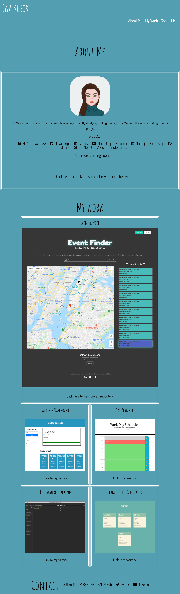

# Professional Portfolio

This project involved building a professional portfolio to showcase my work as a web developer using HTML and CSS. It was created to fulfill the conditions set out by the below user story, and acceptance criteria. 

## User Story

```
AS AN employer
I WANT to view a potential employee's deployed portfolio of work samples
SO THAT I can review samples of their work and assess whether they're a good candidate for an open position
```

## Acceptance Criteria

Here are the critical requirements necessary to develop a portfolio that satisfies a typical hiring manager’s needs:

```
GIVEN I need to sample a potential employee's previous work
WHEN I load their portfolio
THEN I am presented with the developer's name, a recent photo or avatar, and links to sections about them, their work, and how to contact them
WHEN I click one of the links in the navigation
THEN the UI scrolls to the corresponding section
WHEN I click on the link to the section about their work
THEN the UI scrolls to a section with titled images of the developer's applications
WHEN I am presented with the developer's first application
THEN that application's image should be larger in size than the others
WHEN I click on the images of the applications
THEN I am taken to that deployed application
WHEN I resize the page or view the site on various screens and devices
THEN I am presented with a responsive layout that adapts to my viewport

```
<br>

## Technologies Used: 

This project was built with: 

* HTML
* CSS
* Media Queries
* Bootstrap CSS Framework
* FontAwesome
* Google Fonts

<br>
<br>

## Preview 


<br>

<br>
<br>

## Link
The completed website can be viewed here: https://ekubik.github.io/week-two-professional-portfolio/


## Contact
Contact Ewa at <a href="mailto:ewa.kubik@hotmail.com"> ewa.kubik@hotmail.com </a>
